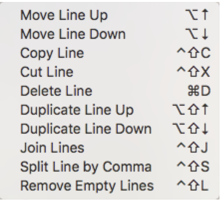

# MGTextPlus
Xcode Source Editor Extension

Download [AppStore](https://itunes.apple.com/us/app/textplus/id1234445803)

## Editor+:

- Remove Comment

### Remove Comment:

### Add Class Delegate

### Add Class Extension

## Line:
- Copy Line
- Cut Line
- Delete Line
- Duplicate Line Up
- Duplicate Line Down
- Join Lines
- Split Line by Comma
- Remove Empty Lines

### Duplicate Line Up:

### Duplicate Line Down:

### Delete Line:

### Join Lines:

### Split Line by Comma:

### Remove Empty Lines:

