# TextPlus
Xcode Source Editor Extension

## Editor+:

- Remove Comment
- Add Type Delegate
- Add Type Extension

### Remove Comment:

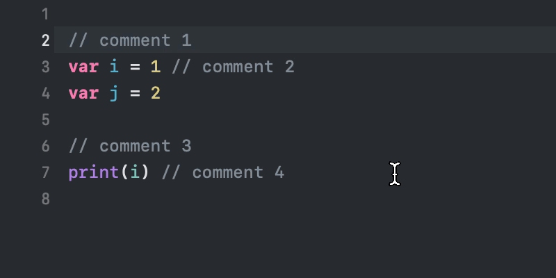

### Add Type Delegate

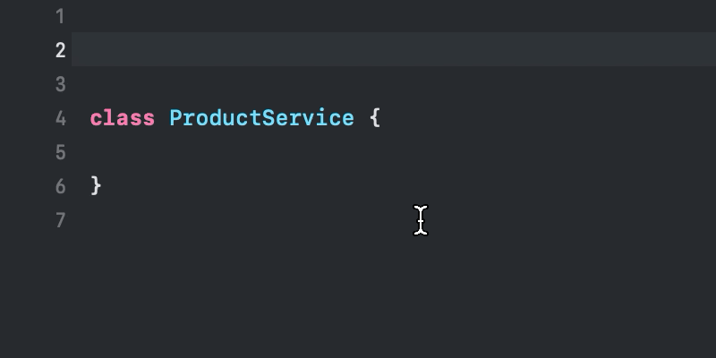

### Add Type Extension

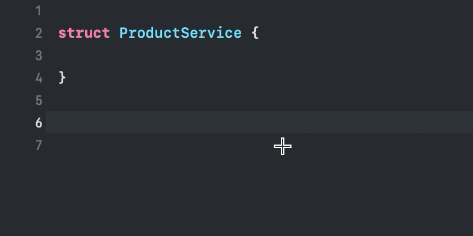

## Line:

- Move Line Up
- Move Line Down
- Copy Line
- Cut Line
- Delete Line
- Clear Line
- Clear Line and Paste
- Duplicate Line Up
- Duplicate Line Down
- Join Lines
- Split Line by Comma
- Remove Empty Lines
- Insert Line Above
- Insert Line Below

### Move Line Up:

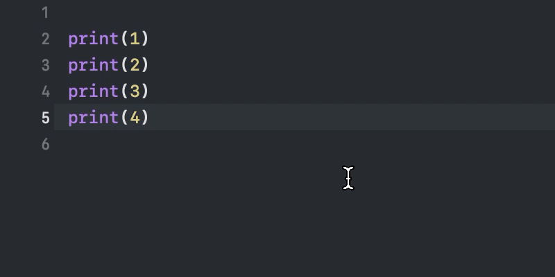

### Move Line Down:

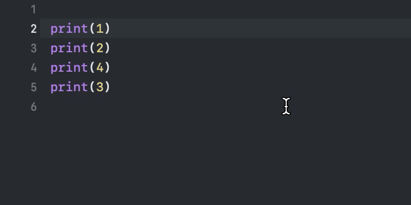

### Duplicate Line Up:

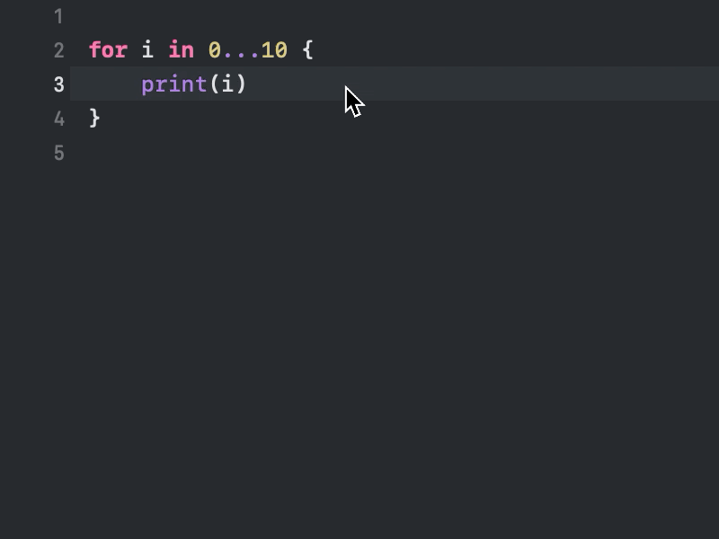

### Duplicate Line Down:

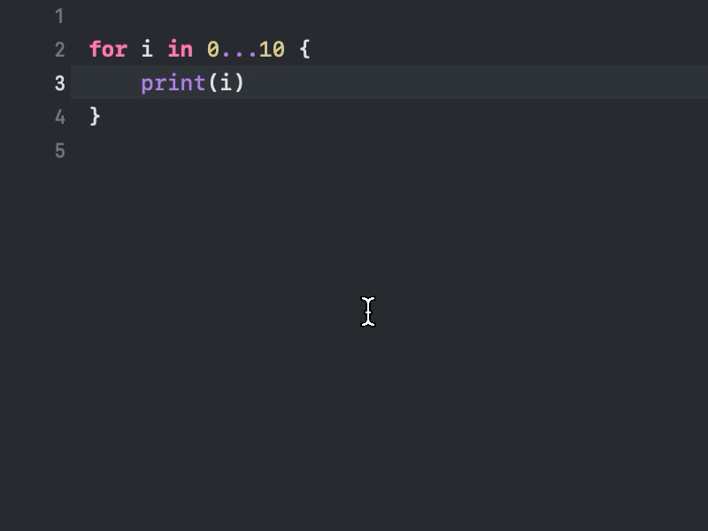

### Delete Line:

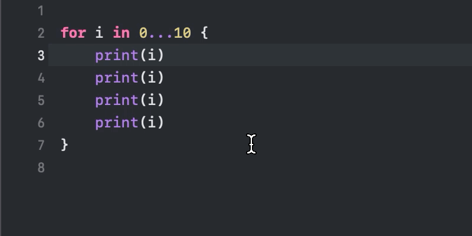

### Join Lines:

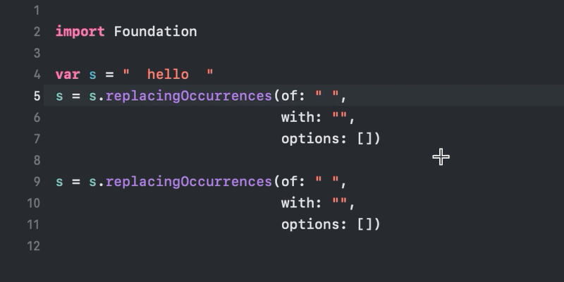

### Split Line by Comma:

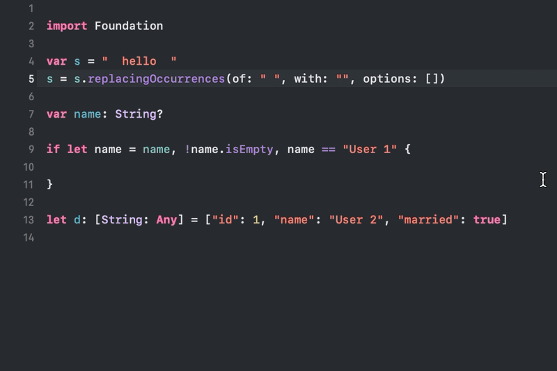

### Remove Empty Lines:

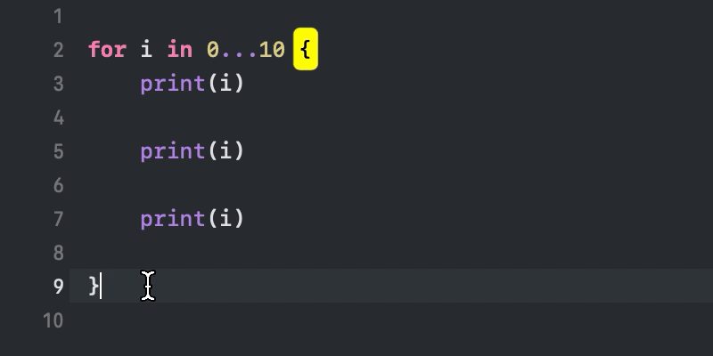

### Insert Line Above:

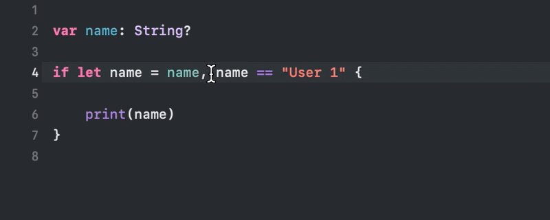

### Insert Line Below:

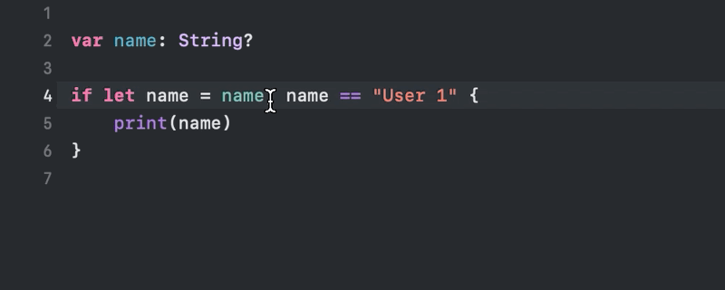

