> [!IMPORTANT]
> **This repository is archived and no longer maintained.**
>
> TextPlus has been renamed **LineSmith for Xcode** and continues on the Mac App Store as version 2.0 — the same app, rewritten with new editor commands and modern macOS support. Development moved to a private repository, so this source tree is frozen at v1.6.0 and is kept for reference only.
>
> **[LineSmith for Xcode on the Mac App Store →](https://apps.apple.com/us/app/linesmith-for-xcode/id1234445803)**
>
> Issues and pull requests here will not be answered. For bug reports or feature requests, please use the support link on the App Store page.

# TextPlus
Xcode Source Editor Extension

## Editor+:

- Remove Comment
- Add Type Delegate
- Add Type Extension

### Remove Comment:

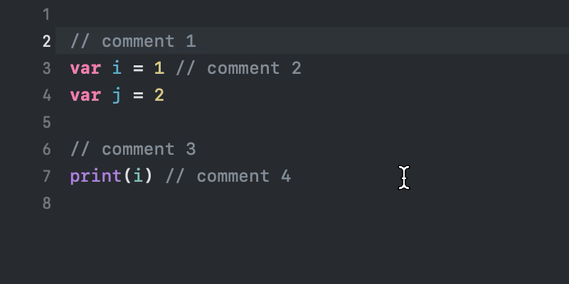

### Add Type Delegate

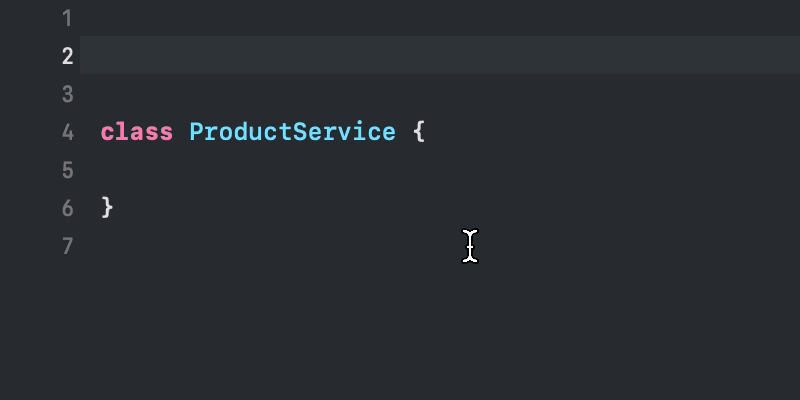

### Add Type Extension

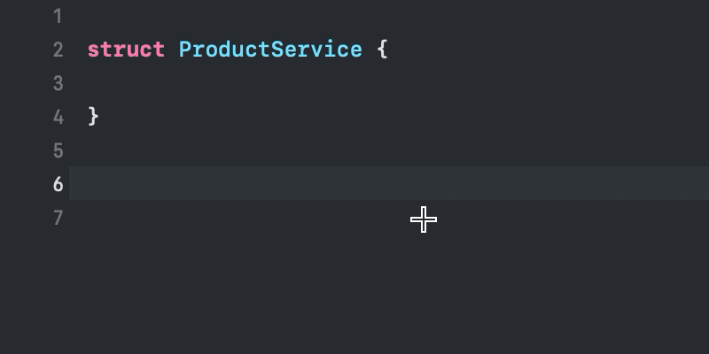

## Line:

- Move Line Up
- Move Line Down
- Copy Line
- Cut Line
- Delete Line
- Clear Line
- Clear Line and Paste
- Duplicate Line Up
- Duplicate Line Down
- Join Lines
- Split Line by Comma
- Remove Empty Lines
- Insert Line Above
- Insert Line Below

### Move Line Up:

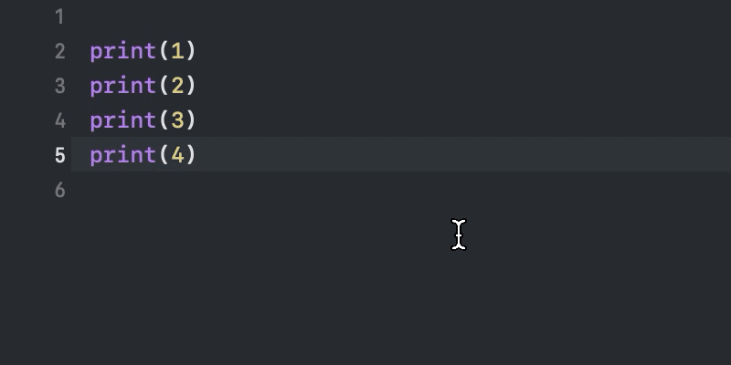

### Move Line Down:

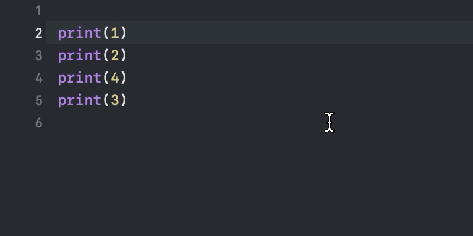

### Duplicate Line Up:

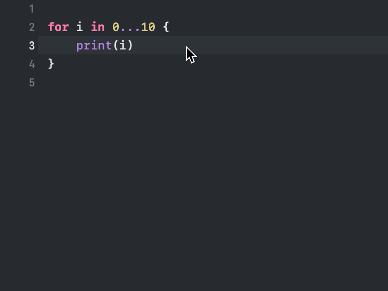

### Duplicate Line Down:

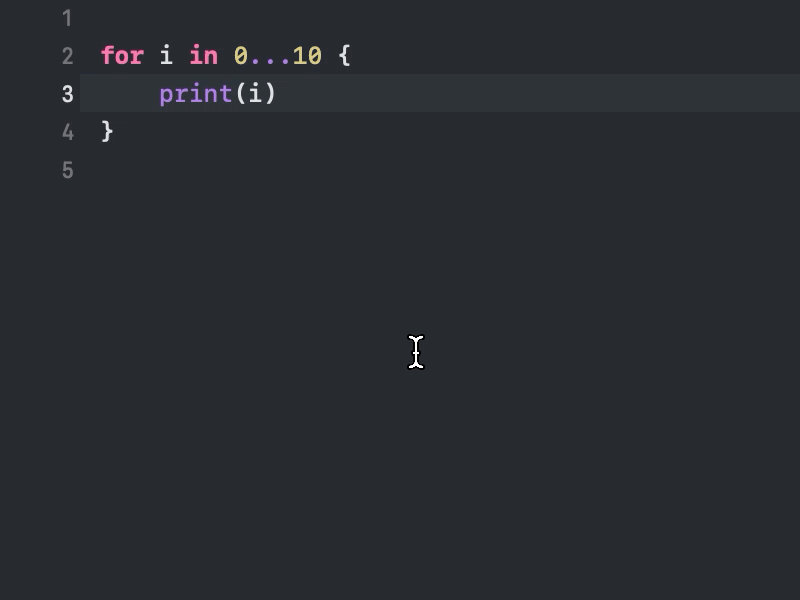

### Delete Line:

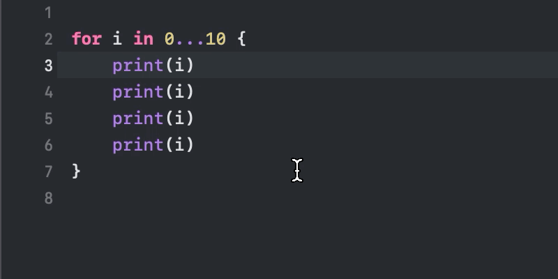

### Join Lines:

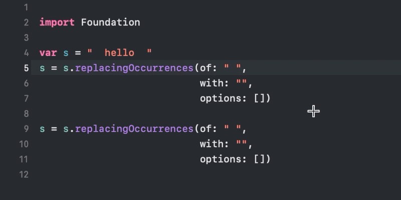

### Split Line by Comma:

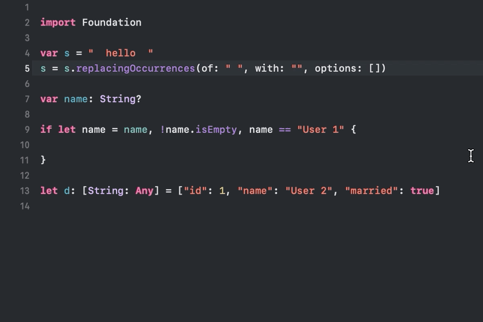

### Remove Empty Lines:

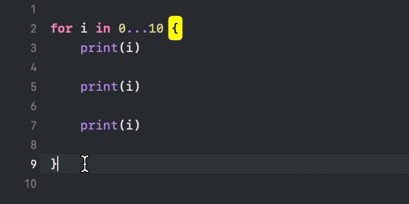

### Insert Line Above:

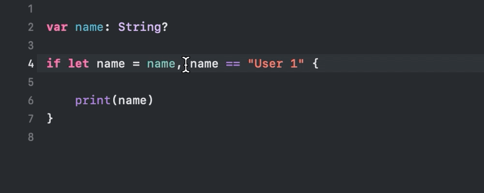

### Insert Line Below:

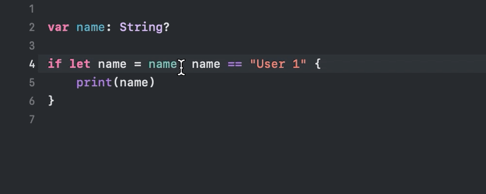

